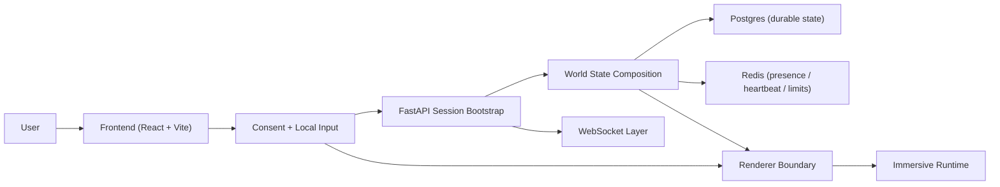

# AETHERIS

AETHERIS is now on the `v1.5` milestone: immersive core plus a production spine. The project keeps the ritual onboarding and spatial interface, but now adds the foundations that make the system defensible as a product.

## Executive summary

AETHERIS is an immersive web experience with a production-shaped backend behind it. The browser handles consent, local input interpretation, and rendering, while the backend owns sessions, typed world composition, persistence, realtime coordination, and observability.

In practice, the project is designed to feel atmospheric without becoming fragile:

- the frontend opens with a ritual onboarding flow instead of a traditional landing page
- camera and microphone remain local-first and permission-gated
- the backend turns session and consent state into a typed `worldState`
- realtime presence is scaffolded with WebSocket, Redis, and heartbeat mechanics
- degraded conditions fall back to a ritual-safe local mode instead of hard failing

This milestone is aimed at something demonstrable, testable, and extendable rather than a one-off visual experiment.

## What ships in v1.5

- FastAPI backend with short-lived JWT sessions.
- Postgres-ready durable session and world snapshot persistence.
- Redis-ready ephemeral presence, websocket heartbeat, and rate limiting.
- Typed OpenAPI export plus generated TypeScript contracts in `frontend/src/generated/api-types.ts`.
- WebSocket foundation with auth, room join, heartbeat, basic broadcast, and disconnect cleanup.
- Real camera and microphone permission flow from the consent CTA.
- Ritual-safe fallback when session bootstrap, consent sync, or renderer startup degrade locally.
- Modular renderer boundary fed only by `worldState`, `localInput`, and `viewport`.
- Health, readiness, metrics, Docker Compose, stronger CI, and smoke coverage.

## System architecture

The repository is split around a clear runtime boundary:

- `frontend/` owns consent UX, camera and microphone permission requests, local-only input sampling, React state, and renderer orchestration.
- `backend/` owns anonymous session bootstrap, JWT validation, world recompute logic, websocket auth, persistence access, metrics, and service health.
- `Postgres` is the durable layer for sessions and world snapshots.
- `Redis` is the ephemeral layer for presence, room membership, websocket heartbeat, and rate limiting.
- Typed contracts connect both sides through exported OpenAPI and generated TypeScript definitions.



The most important architectural rule is that the renderer only consumes `worldState`, `localInput`, and `viewport`. That keeps rendering isolated from API details and helps the app degrade safely when backend or graphics capabilities are limited.

For deeper reference:

- API surface: [docs/api.md](docs/api.md)
- Architecture notes: [docs/architecture.md](docs/architecture.md)
- Forward roadmap: [docs/roadmap.md](docs/roadmap.md)

## User flow

From the README and current docs, the intended runtime path is:

1. The visitor lands in the ritual shell and moves from `void` into the consent phase.
2. No camera or microphone request is made until the user explicitly acts on the consent CTA.
3. The frontend requests media permissions and derives local input signals in-browser.
4. The frontend initializes an anonymous backend session and receives a JWT, feature flags, room id, and initial `worldState`.
5. The consent payload is posted back to the backend so the world can be recomputed from the accepted capabilities.
6. The renderer starts from the typed world state and local input snapshot.
7. The WebSocket layer joins the room and keeps presence and heartbeat state alive.
8. If any critical step degrades, the app continues in ritual-safe mode instead of trapping the user in a broken funnel.

## Repository layout

```text
.
|-- backend/         FastAPI production spine
|-- frontend/        React immersive client
|-- docs/            API and architecture notes
|-- infrastructure/  Infra and observability notes
|-- docker-compose.yml
`-- .github/         CI and PR automation
```

## Technology stack

- Backend: FastAPI, SQLAlchemy, Alembic, asyncpg, Redis, PyJWT, Prometheus client
- Frontend: React 19, Vite, TypeScript, Zustand, Three.js
- Local orchestration: Docker Compose for Postgres and Redis
- Tooling: `uv` for Python environment management, `npm` workspaces for frontend workflow

Recommended local runtime from the checked-in manifests:

- Python `>=3.12`
- Node `>=24.0.0`
- npm `>=11.0.0`

## Local development

### Quick start

```bash
cd C:\Users\guilh\PROJETOS\AETHERIS
docker compose up -d

cd backend
uv sync --dev
uv run alembic upgrade head

cd ..
npm install
npm run dev
```

`npm run dev` from the repository root starts the FastAPI backend and the Vite frontend together. Docker Compose keeps Postgres and Redis available for the production-shaped local flow.

Local URLs after boot:

- Frontend: `http://127.0.0.1:5173`
- Backend docs: `http://127.0.0.1:8000/docs`
- Healthcheck: `http://127.0.0.1:8000/api/v1/admin/health`

### 1. Infrastructure

```bash
cd C:\Users\guilh\PROJETOS\AETHERIS
docker compose up -d
```

### 2. Backend setup

```bash
cd backend
uv sync --dev
uv run alembic upgrade head
uv run uvicorn app.main:app --reload
```

Environment defaults live in `backend/.env.example`. Copy them to `backend/.env` when you need an explicit local override.

### 3. Frontend setup

```bash
cd C:\Users\guilh\PROJETOS\AETHERIS
npm install
npm run dev --workspace frontend
```

The frontend defaults to `VITE_API_BASE_URL=http://127.0.0.1:8000`.

### 4. Contracts and type sync

The backend exports OpenAPI and the repository turns that into frontend TypeScript types. This is the main contract boundary between the API and the immersive client.

```bash
cd backend
uv run python scripts/export_openapi.py

cd ..
npm run generate:api-types
```

### 5. Resilience notes

- If the backend session bootstrap fails, the frontend continues in a ritual-safe local mode instead of trapping the user in the consent flow.
- If consent sync or realtime presence fail, the world still opens and surfaces a degraded-mode notice.
- If WebGPU or WebGL renderer creation fails, the viewport falls back to the static ritual shell.

## Validation

If you want the shortest reliable validation path, use this order:

1. backend quality checks
2. frontend lint and typecheck
3. frontend unit tests
4. frontend production build
5. browser smoke test

That sequence catches most contract, runtime, and rendering regressions with less guesswork.

### Backend

```bash
cd backend
uv run ruff check
uv run mypy
uv run pytest
```

What this covers:

- `ruff check`: style and static quality issues
- `mypy`: strict typing across the backend package
- `pytest`: API and service behavior

### Frontend

```bash
cd C:\Users\guilh\PROJETOS\AETHERIS
npm run lint --workspace frontend
npm run typecheck --workspace frontend
npm run test --workspace frontend
npm run build --workspace frontend
npm run test:smoke --workspace frontend
```

What this covers:

- `lint`: frontend code quality and hook discipline
- `typecheck`: TypeScript contract integrity
- `test`: unit and integration behavior in Vitest
- `build`: production compilation health
- `test:smoke`: end-to-end boot path through the browser shell

## How to present the project quickly

If you need to explain AETHERIS to another person in under a minute, this is the shortest faithful version:

> AETHERIS is an immersive frontend experience backed by a real product spine. The browser handles consented local input and rendering, the backend turns session and consent into typed world state, and the system is built to keep working even when media, realtime, or renderer layers degrade.

## Current scope boundary

This repository intentionally does not implement full CRDT state, WebRTC mesh, complete temporal echoes, paid biomes, or heavy generative AI yet. Those remain later milestones so v1.5 can stay stable, testable, and demonstrable.
